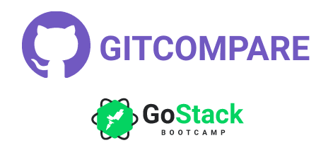

<h1 align="center">
  

React GitCompare

</h1>

<h4 align="center">
Github repos compare with React
</h4>

<p align="center">
  

  

  

  <a href="https://api.codacy.com/project/badge/Grade/c5aeea379c5041c1b34e4e0163e84496" target="_blank">
    
  </a>

  
</p>

<p align="center">
  

</p>

  <p align="center">
  <a href="https://mk-gitcompare.netlify.com/" target="_blank">
    
  </a>
</p>

## :rocket: Technologies

This project was developed at the [RocketSeat GoStack Bootcamp](https://rocketseat.com.br/bootcamp) with the following technologies:

- [ReactJS](https://reactjs.org/)
- [Axios](https://github.com/axios/axios)
- [React Router](https://www.npmjs.com/package/react-router-dom)
- [styled-components](https://www.styled-components.com/)
- [VS Code](https://code.visualstudio.com/) with [EditorConfig](https://marketplace.visualstudio.com/items?itemName=EditorConfig.EditorConfig) and [ESLint](https://marketplace.visualstudio.com/items?itemName=dbaeumer.vscode-eslint)

## :information_source: How To Use

To clone and run this application, you'll need [Git](https://git-scm.com), [Node.js v10.16](https://nodejs.org/) or higher, [Yarn v1.13](https://yarnpkg.com/) or higher installed on your computer. From your command line:

```bash
# Clone this repository
$ git clone https://github.com/matheuskuster/gostack-gitcompare

# Go into the repository
$ cd gostack-gitcompare

# Install dependencies
$ yarn install

# Run it
$ yarn start
```

## :memo: License

This project is under the MIT license. See the [LICENSE](https://github.com/matheuskuster/gostack-gitcompare/blob/master/LICENSE) for more information.

---

Made with ♥ by Matheus Kuster :wave: [Get in touch!](https://www.linkedin.com/in/matheus-kuster/)
